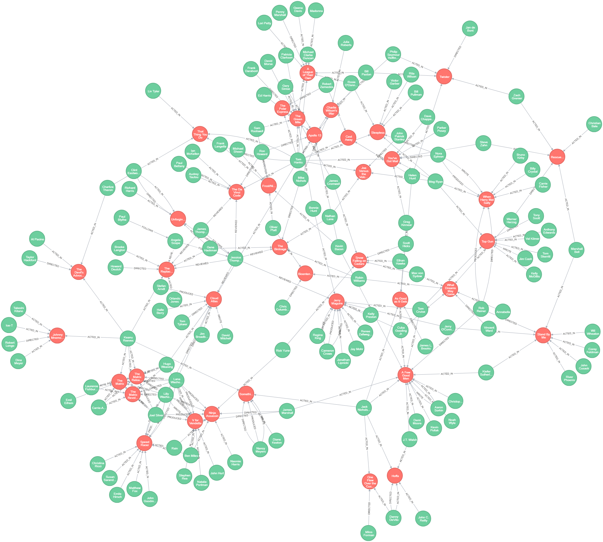

# Neo4J WorkShop by Lio Bouchan
Material extracted to give a WorkShop of Neo4j , the Objective is to create a Graph Database on Neo4j, using Neo4j tools. (Browser , Desktop).


## Getting Started
This project have only teach material to deploy some cypher query languaje of
Neo4J to learn this graph database.

This guide explains the basic concepts of Cypher, Neo4j’s query language. You should be able to read and understand Cypher queries after finishing this guide.


### Prerequisites
You should have familiarized yourself with Graph Databases and the Property Graph Model.

You have to install :

[Neo4J](https://neo4j.com/download/) - Neo4j Desktop: Developer-Friendly Packaging

## Content
* Slides
    * Neo4J Intro
* Build Movie Graph Data Base
    * Views of the final Graph Data Base
    * Queries
        * Create
        * Find
        * Query
        * Solve
        * Recommend
        * Clean Up
* Import From RDBMS to Graph
* Build A Semantic Data with Neo4j

## Running Cyphers
Cypher is a declarative, SQL-inspired language for describing patterns in graphs visually using an ascii-art syntax.

It allows us to state what we want to select, insert, update or delete from our graph data without requiring us to describe exactly how to do it.

Write this query on Neo4J Browser

```
//Find 10 people...
    MATCH (people:Person) RETURN people.name LIMIT 10
```
See the Magic
```
╒════════════════════╕
│"people.name"       │
╞════════════════════╡
│"Emil"              │
├────────────────────┤
│"Johan"             │
├────────────────────┤
│"Ian"               │
├────────────────────┤
│"Rik"               │
├────────────────────┤
│"Allison"           │
├────────────────────┤
│"Keanu Reeves"      │
├────────────────────┤
│"Carrie-Anne Moss"  │
├────────────────────┤
│"Laurence Fishburne"│
├────────────────────┤
│"Hugo Weaving"      │
├────────────────────┤
│"Lilly Wachowski"   │
└────────────────────┘
```

```

```

I have wrote some files with cypher extension with differents reasons.

* Create - Have the query to create a Neo4J Database related to movies.
* Finds - Querys to learn how to find on Cypher Language
* Query - Querys on Cypher Language
* Solve - To Solve some basic problems like basic path find
* Recommend - More elaborated queries , to automated recommends in base of searching.
* CleanUp - Simple queries to delete all the DataBase and view all Nodes.

## Authors

* **Leonardo Bouchan** - *Recopilate Information from Neo4J Docs and separate in special teach cases to learn how does Neo4J and Cypher work for Developers* 

## Acknowledgments
* Thanks to Rhisco to assing me this Project
* Thanks Neo4J for your beautiful Documentation